# DB migrations with Spring, Gradle, FlyWay

Go to [spring initializr](https://start.spring.io/) chose:
- Gradle - Grovy
- Java
- Spring Boot 3.5.0
- Packaging Jar
- Java 24

Add dependencies:

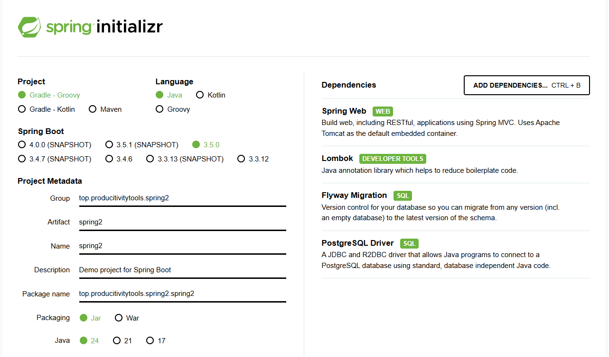

Go to directory and build ```gradlew.bat build```

It throws exception:

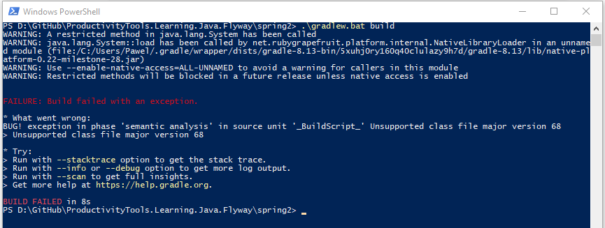

Current version of gradle ```.\gradlew.bat --version``` [does not support Java 24](https://docs.gradle.org/current/userguide/compatibility.html).

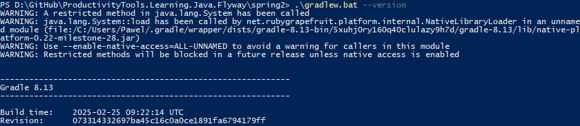

Edit the ```gradle-wrapper.properties``` file (change version to 14)

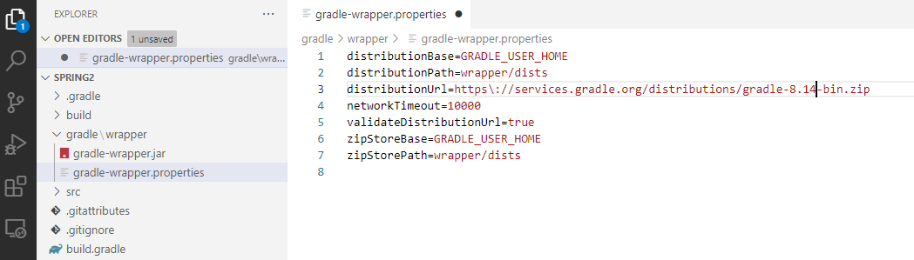

Invoke ```.\gradlew.bat wrapper```. ```gradlew.bat build``` should finish with success. 

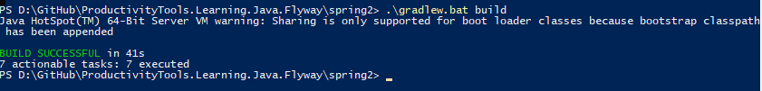

In the main directory create ```FlyWayConfiguration.java``` file with the following content:


```java
import lombok.RequiredArgsConstructor;
import org.flywaydb.core.Flyway;
import org.springframework.context.annotation.Bean;
import org.springframework.context.annotation.Configuration;
import org.springframework.core.env.Environment;

@Configuration
@RequiredArgsConstructor
public class FlyWayConfiguration {

    private final Environment environment;

    @Bean(initMethod = "migrate")
    public Flyway flyway() {
        return new Flyway(Flyway.configure()
                .baselineOnMigrate(true)
                .dataSource(
                        environment.getRequiredProperty("spring.datasource.url"),
                        environment.getRequiredProperty("spring.datasource.username"),
                        environment.getRequiredProperty("spring.datasource.password")));
    }
}
```

Probably default test will start failing, comment it.

In the resources directory open application properties. Add the content (notice that there is no ' or "):
```java
spring.datasource.url=jdbc:postgresql://localhost:5432/postgres
spring.datasource.username=postgres
spring.datasource.password=Pawel123
spring.datasource.driver-class-name=org.postgresql.Driver

logging.level.org.springframework.security=DEBUG
logging.level.org.flywaydb=DEBUG
```
In the directory ```resources/db/migration``` craete fle ```V1__Initial.sql```. Fill with the content:

```
CREATE TABLE IF NOT EXISTS product
(
    id                    SERIAL PRIMARY KEY,
    brand                 VARCHAR(255)      NOT NULL,
    category              VARCHAR(255)      NOT NULL,
    name                  VARCHAR(255)      NOT NULL,
    flavour               VARCHAR(255)      NULL,
    calories_per_100_gram NUMERIC(5, 1)     NOT NULL,
    weight_gram           NUMERIC(5, 1)     NOT NULL
);

```
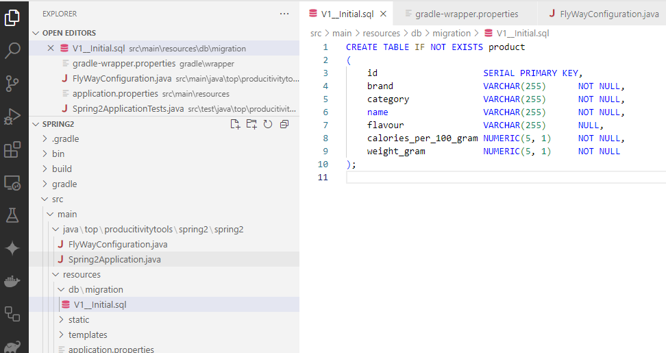

Open **pgAdmin** and validate if database is empty:
```
SELECT table_schema, table_name, table_type
FROM information_schema.tables
WHERE table_schema = 'public' 
  AND table_type = 'BASE TABLE'
ORDER BY table_schema, table_name;
```

Run ```.\gradlew.bat bootrun``` scripts should be executed. 
Validate databases again. 

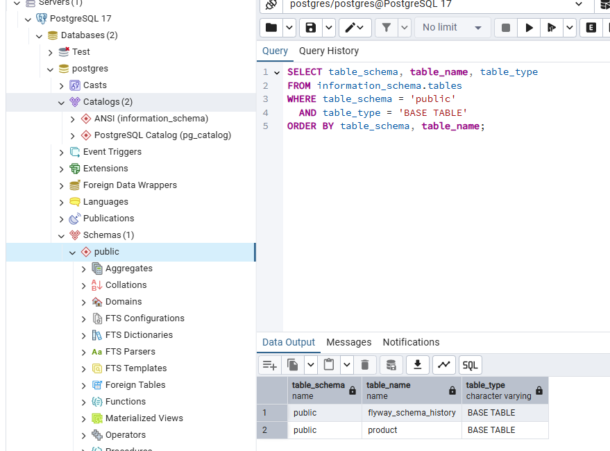


[I used tutorial](https://medium.com/@ekaterina_kazakova/spring-boot-application-with-postgresql-database-inside-along-with-flyway-for-migration-and-fb9513fe7cfb)

----------------

## Install 
- Gradle extension
- Extension Pack for Java


## Create project
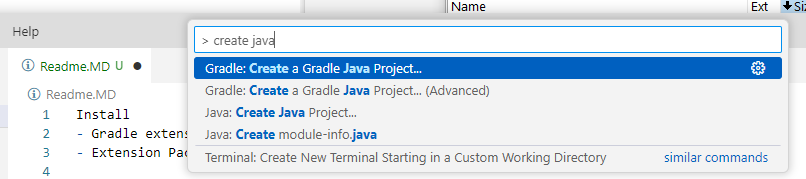

- Craete directory
- Chose Gradle
- Wizard will ask if open project in vs code. 

## Review generated code
- in the build gradle we see application node, that defines mainClass of our application

## Run
[CRTL + SHIFT + P]  

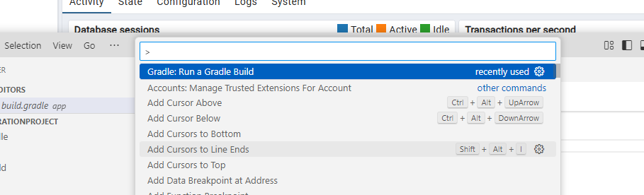

Run task

or go to the gradle extension and execute run task from the application node.

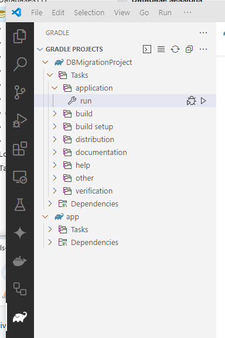

### Task **Run**
Task run is automatically added to the gradle when application plugin is added to the gradle.

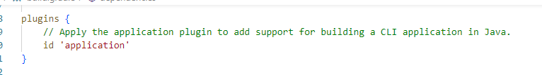